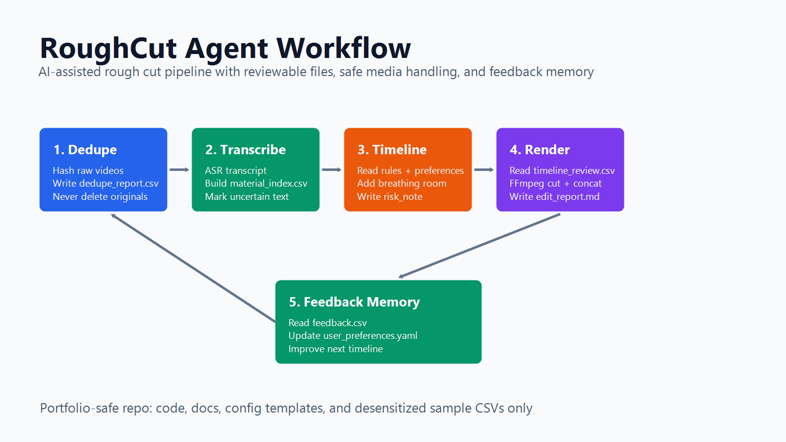

# RoughCut Agent

RoughCut Agent 是一个面向短视频和口播素材的 AI 粗剪工作流 Agent。它把“素材去重、语音识别、素材索引、内容排序、时间线生成、FFmpeg 粗剪合成、字幕配置、用户反馈学习”串成一个可复用流程，而不是停留在单次调用 AI 的 demo。

这个仓库是作品集版本：不包含真实视频素材、不包含隐私数据、不包含本地绝对路径，只展示代码、文档、配置模板和脱敏示例。



## Repository Structure

```text
roughcut-agent
├── README.md
├── AGENTS.md
├── .gitignore
├── requirements.txt
├── LICENSE
├── docs
│   ├── case-study.md
│   ├── workflow.md
│   ├── editing-principles.md
│   └── interview-summary.md
├── skills
│   └── video-auto-editor
│       └── SKILL.md
├── scripts
│   ├── dedupe_raw_videos.py
│   ├── stage1_transcribe_index.py
│   ├── stage2_generate_timeline.py
│   ├── stage3_render_rough_cut.py
│   └── apply_user_feedback.py
├── configs
│   ├── editing_rules.yaml
│   └── user_preferences.yaml
├── examples
│   ├── sample_material_index.csv
│   ├── sample_timeline_review.csv
│   ├── sample_edit_report.md
│   └── sample_feedback.csv
└── assets
    └── workflow_diagram.png
```

## 我解决了什么问题

短视频和口播素材的粗剪阶段通常很耗时：

- 同一段素材可能重复导入，需要先去重。
- 长视频需要转写成可搜索、可排序的素材行。
- 剪辑不是简单拼接，需要保留气口、节奏和语义连续。
- 口播素材里常有重复表达、停顿、跑题和识别错别字。
- 每个人的剪辑偏好不同，需要把反馈沉淀成下次可复用的规则。

RoughCut Agent 的目标是把这些重复劳动变成一个稳定、可复查、可迭代的工作流。

## 为什么有产品价值

它对应的是创作者、内容运营、短视频团队在日常生产里的高频痛点：大量口播素材进入剪辑之前，需要先完成“可被理解和筛选”的结构化处理。

这个 Agent 不只是帮用户生成一个结果，而是把剪辑流程拆成多个可检查阶段。每一步都有中间文件、报告和人工复核点，因此适合真实生产场景：

- 降低素材整理和初剪时间。
- 把剪辑经验结构化成规则。
- 支持人机协作，不把不确定判断伪装成确定结果。
- 能通过反馈持续调整排序、保留片段、气口和内容风格。

## 输入和输出

输入：

- `raw/` 中的本地视频素材，仓库不会上传这个目录。
- `configs/editing_rules.yaml` 中的剪辑规则。
- `configs/user_preferences.yaml` 中的用户偏好记忆。
- 可选的 `output/feedback.csv` 或 `examples/sample_feedback.csv` 用户反馈表。

输出：

- `output/dedupe_report.csv`：去重报告。
- `output/material_index.csv`：转写后的素材索引。
- `output/timeline_review.csv`：可复查的粗剪时间线。
- `output/final_rough_cut.mp4`：FFmpeg 合成的粗剪视频。
- `output/edit_report.md`：粗剪报告。

`output/` 目录默认不上传 GitHub。

## 工作流阶段

1. 素材去重：计算视频哈希，识别重复素材，只输出报告或按明确参数隔离重复项，不硬删除原始素材。
2. 语音转写：通过可插拔 ASR 生成口播文本，并支持字幕字段。
3. 素材索引：把素材拆成带时间码、文本、质量标记和风险提示的结构化行。
4. 时间线生成：根据剪辑规则、内容密度、语义连续性和用户偏好生成 `timeline_review.csv`。
5. 粗剪合成：读取已确认的时间线，用 FFmpeg 裁切并拼接成粗剪版。
6. 用户反馈学习：读取反馈表，把偏好沉淀到 `configs/user_preferences.yaml`，供下一次排序和剪切点调整使用。

## 不是单纯调用 AI

这个项目的重点不是“调用一个模型生成剪辑建议”，而是把 AI 能力产品化成可复用流程：

- 用配置文件表达剪辑原则。
- 用 CSV 作为人机协作的复核界面。
- 用风险字段记录不确定判断。
- 用 FFmpeg 做可执行的粗剪合成。
- 用反馈文件保存用户偏好，让下一次生成更接近用户风格。

AI 负责理解和结构化，工程流程负责可复查、可执行和可迭代。

## 当前验证结果

该流程已经在真实本地素材上跑通，作品集仓库不展示真实素材，只展示脱敏样例和流程设计。

本地验证结果：

- 成功完成 12 个去重视频。
- 生成 43 条时间码素材行。
- 生成 13 个粗剪片段。
- 合成 179 秒最终粗剪版。

## 快速开始

安装依赖：

```bash
pip install -r requirements.txt
```

生成时间线示例：

```bash
python scripts/stage2_generate_timeline.py --material-index examples/sample_material_index.csv --output output/timeline_review.csv
```

应用反馈学习示例：

```bash
python scripts/apply_user_feedback.py --feedback examples/sample_feedback.csv
```

真实素材粗剪需要本地安装 FFmpeg，并把视频放到不会上传的 `raw/` 目录中。

## 面试官可以看到什么

通过这个 GitHub 项目，面试官可以看到：

- 我如何把 AI 能力拆解成可落地的产品工作流。
- 我如何处理真实生产里的素材安全、复核和不确定性。
- 我如何把用户反馈转化为配置和偏好记忆。
- 我如何用轻量脚本、配置文件和文档构建可迭代的 Agent 项目。
