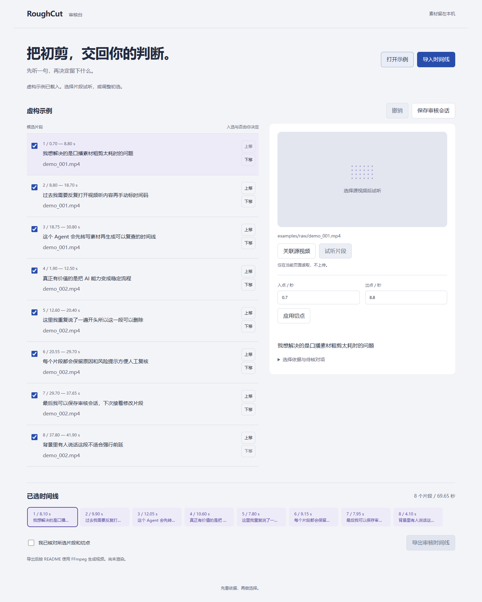

# RoughCut Review

本地口播初剪工具：把视频转成带时间的文字，试听并选择片段，调整顺序和切点，再输出可以继续精剪的视频。原始素材保持不变。



## 先试审核台

需要 Python 3.11。无需 API 密钥、数据库或 Node 运行环境。

```bash
python -m pip install -r requirements-plugin.txt
python scripts/review_server.py
```

打开 http://127.0.0.1:8890，点击“打开示例”。示例是虚构索引，不附带视频。可以选择、恢复、移动片段，修改切点，撤销和保存审核会话。试听自己的素材需要点击“关联源视频”。文件只在当前浏览器读取，不上传。

## 用自己的口播素材

需安装 FFmpeg，确保 `ffmpeg -version` 和 `ffprobe -version` 可运行。把有权处理的视频放进本仓库 `raw/`，不提交这些文件。建议使用 H.264/AAC MP4 便于浏览器试听。

1. 安装本地 ASR 并转写。首次运行需联网下载模型；媒体本身不上传。默认 CPU int8，中文 small 模型：

```bash
python -m pip install -r requirements-asr.txt
python scripts/stage1_transcribe_index.py --raw-dir raw --output output/session-01/material_index.csv --model small --language zh
```

生成 CSV 和 `material_index.asr.json`，保留原始转写、词时间戳、识别信号、模型版本和源文件哈希。没有语音的文件记为 no_speech；识别失败记为 error 并以非零状态退出。不用占位片段冒充成功。已有模型可加 `--local-files-only` 离线运行。

2. 生成初选：

```bash
python scripts/stage2_generate_timeline.py --input output/session-01/material_index.csv --output output/session-01/initial/timeline_review.csv
```

同时生成 `timeline_review.json`。默认保留输入顺序、限制总时长和片数，不按虚构音质分排名、不强行截断长句。未选候选及原因仍保留。

3. 在审核台导入这个 JSON，关联对应源视频，试听和调整。可保存会话下次继续。核对后导出 `timeline_review.csv`，将下载文件放到新建的 `output/session-01/reviewed/`。浏览器不会替你写入仓库，也不会直接启动 FFmpeg。

4. 明确确认已审核后渲染：

```bash
python scripts/stage3_render_rough_cut.py --timeline output/session-01/reviewed/timeline_review.csv --output-dir output/session-01/render --reviewed
```

结果包括 MP4、中间片段、JSON 验收数据和 Markdown 报告。按 CSV 的 order 排序，统一为 1280×720、30fps、48kHz 双声道；竖屏加留白，不裁掉画面，无音轨素材补静音。已有结果不会覆盖。命令应在仓库根目录运行。

需要把转写交给后续字幕编辑时，在渲染命令后增加：

```bash
--captions-from output/session-01/material_index.asr.json
```

额外生成与成片同名的 SRT、VTT 和 `captions.json`。词时间戳随审核后的顺序与切点重新计时；素材与识别记录不符时拒绝生成，缺失或被切点截断的词记入风险清单。字幕是需试听校对的草稿，不覆盖原文，不烧进画面。[完整命令与规则](docs/captions.md)

## 插件与维护

`.codex-plugin/plugin.json` 提供插件元信息，`skills/roughcut-planner/SKILL.md` 负责逐步调用本地工作流。宿主仍决定是否运行命令和处理用户选择的文件。JSON 接口只规划，不隐式转写或渲染：

```bash
python scripts/plugin_run.py --input examples/plugin-input.json --output-dir output/plugin-01
python -m unittest discover -s tests -v
```

前端回归需要 Node 20+：`npm ci`、`npx playwright install chromium`、`npm run test:browser`。使用本机 Chrome 可设置 `BROWSER_CHANNEL=chrome`。

[产品判断](docs/product-case.md) | [设计与交互](docs/review-design.md) | [技术验收](docs/validation.md) | [开源选择](docs/open-source.md) | [更新记录](CHANGELOG.md)

## 能力边界

ASR 提供文字和时间信号，不等于音质、语义或剪辑审美判断；片段边界和导出字幕必须试听。当前可导出单语字幕草稿，不自动翻译或烧录字幕，不做画面质量评分、多人说话分离或自动叙事创作。反馈只是显式偏好变更，没有训练模型。技术验收采用自行生成的测试素材，没有真实剪辑者效率或业务收益结论。
